# HTML Slides — 自包含演示文稿生成器

> 从零开始或通过转换 PowerPoint 文件，生成精美、动画丰富、自包含的 HTML 演示文稿。

零依赖。单一 HTML 文件，CSS/JS 全部内联。浏览器打开即可演示。

## 特性

- **零依赖** — 单一 HTML 文件，CSS/JS 全部内联。无需 npm 或构建工具。
- **固定 16:9 舞台** — 1920×1080 幻灯片画布，整体缩放适配任意视口。移动端不重排。
- **样式发现** — 生成 3 个视觉预览，所见即所选，而非凭空描述。
- **动画丰富** — 交错渐显、缩放过渡、模糊效果、背景纹理等。
- **行内编辑** — 鼠标悬停左上角或按 E 键，直接在浏览器中编辑文本。
- **PPT 转换** — 将 PowerPoint 文件转换为 HTML，支持样式选择。
- **独特设计** — 12 套当代国际化风格预设，拒绝千篇一律的"AI 稀烂美学"。

## 安装

### 方式一：作为项目 Skill 使用（推荐）

将本仓库克隆到本地，在 WorkBuddy 中打开该项目目录即可自动激活 Skill：

```bash
git clone https://github.com/vividvictor/html-slides.git
cd html-slides
# 在 WorkBuddy 中打开此目录，技能自动激活
```

### 方式二：作为全局 Skill 使用

将 Skill 目录复制到用户级 Skill 目录，即可在任意项目中使用：

```bash
# 复制到全局 Skill 目录
cp -r .workbuddy/skills/html-slides ~/.workbuddy/skills/html-slides
```

> Windows 用户路径为 `C:\Users\<你的用户名>\.workbuddy\skills\html-slides`

### 方式三：从 WorkBuddy Skill 市场安装（即将支持）

未来可通过 WorkBuddy Skill 市场一键安装，无需手动操作。

## 使用

在 WorkBuddy 对话中，使用以下触发词即可激活 Skill：

| 触发词示例 | 模式 |
|-----------|------|
| "做一份演示文稿"、"帮我做 slides"、"create slides" | **新建演示文稿** |
| "把这个 PPT 转成 HTML"、"convert this pptx" | **PPT 转换** |
| "增强这份演示文稿"、"修改这个 HTML deck" | **增强现有文稿** |

### 新建演示文稿流程

```
1️⃣ 你说需求 → "帮我做一份创业路演的演示文稿，10页左右"
2️⃣ Skill 提问 → 用途？篇幅？内容？密度？（一次问完）
3️⃣ 样式预览 → 生成 3 张风格预览图，你选一个或混搭
4️⃣ 生成文稿 → 输出单一 HTML 文件，浏览器打开即可演示
5️⃣ 交付预览 → WorkBuddy 中直接预览，支持行内编辑
6️⃣ 分享导出 → 可部署为在线 URL 或导出 PDF
```

### PPT 转换流程

```
1️⃣ 你提供文件 → 上传 .pptx 文件或提供路径
2️⃣ 内容提取 → 自动提取幻灯片标题、内容、图片
3️⃣ 样式预览 → 同上，生成 3 张风格预览
4️⃣ 生成 HTML → 保留原内容结构，赋予全新视觉风格
```

### 行内编辑

生成后的演示文稿支持行内编辑：

- **鼠标**：悬停左上角热区，进入编辑模式
- **键盘**：按 `E` 键切换编辑模式
- 直接点击文本即可修改，修改后自动保存到 HTML 文件

### 导航控制

| 操作 | 控制 |
|------|------|
| 下一页 | `→` / `Space` / 滑动 |
| 上一页 | `←` / 滑动 |
| 第一页 | `Home` |
| 最后一页 | `End` |
| 全屏 | `F` 键 |

## 技能结构

```
.workbuddy/skills/html-slides/
├── SKILL.md                      # 主工作流程（渐进式披露）
├── references/
│   ├── viewport-base.css         # 强制性固定舞台 CSS
│   ├── html-template.md          # HTML 架构与 JS 功能
│   ├── animation-patterns.md     # 动画参考与效果-感觉对照
│   └── style-presets.md          # 12 套当代国际化视觉风格定义
├── scripts/
│   └── extract-pptx.py           # PPT 内容提取脚本
└── assets/                       # （模板与素材，后续添加）
```

## 风格预设

| # | 名称 | 氛围 | 主题 |
|---|------|------|------|
| 1 | 建筑 Architect | 精准、克制、国际理性 | 浅色 |
| 2 | 熔岩 Lava | 电影感、沉稳叙事 | 深色 |
| 3 | 极光 Aurora | 流动、科技前沿 | 深色 |
| 4 | 赤金 Aureate | 奢华、权威、金融 | 深色 |
| 5 | 雾林 Mist Grove | 自然、可持续 | 深色 |
| 6 | 冰川 Glacier | 极简、纯净、可信 | 浅色 |
| 7 | 混凝土 Concrete | 粗犷、Neo-Brutalism | 浅色 |
| 8 | 纸墨 Ink Paper | 编辑感、沉思 | 浅色 |
| 9 | 电光 Volt | 快节奏、创业路演 | 深色 |
| 10 | 砂岩 Sandstone | 温暖、生活方式 | 浅色 |
| 11 | 芭乐 Guava | 温暖、手绘、亲切 | 浅色 |
| 12 | 玄金 Obsidian | 冷静沉着、中国漆器 | 深色 |

## Template Gallery

<table>
<tr>
<td width="50%">

### 1. 建筑 Architect
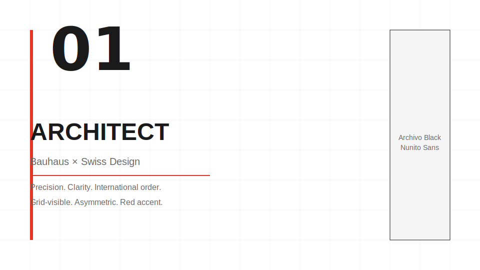

精准、克制、国际理性。网格可见，红线点缀，不对称留白。

</td>
<td width="50%">

### 2. 熔岩 Lava
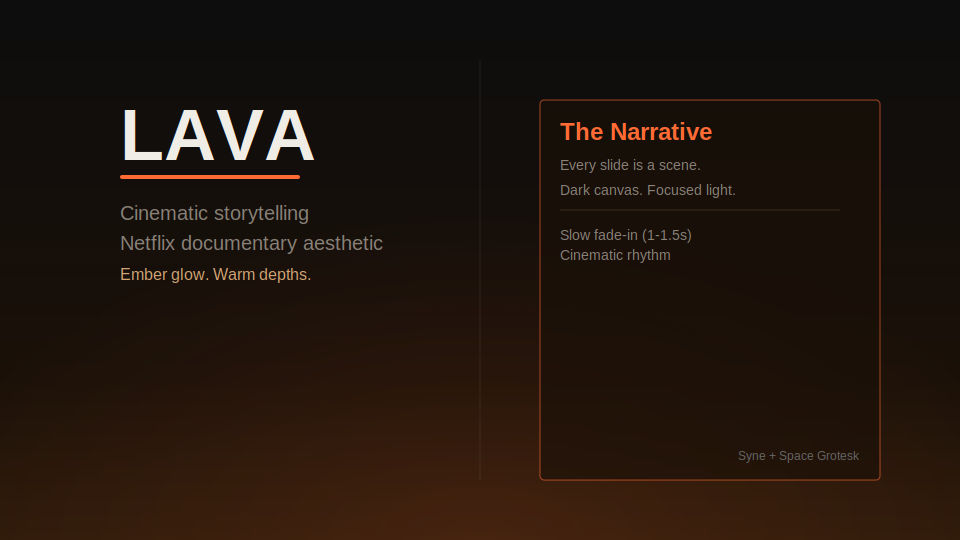

电影感、沉稳叙事。暗底暖光渐变，Netflix 纪录片美学。

</td>
</tr>
<tr>
<td width="50%">

### 3. 极光 Aurora
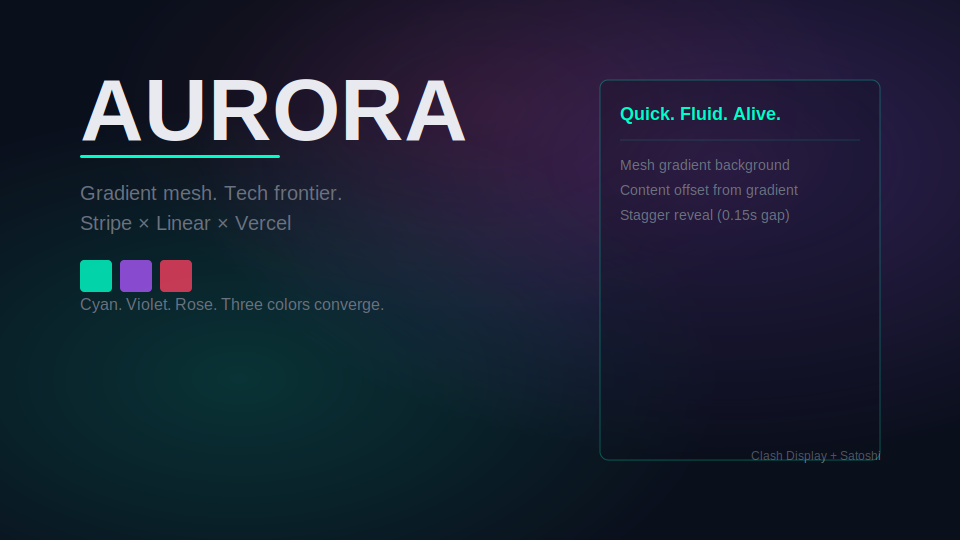

流动、科技前沿。Mesh gradient 流动色彩，Stripe × Linear 视觉。

</td>
<td width="50%">

### 4. 赤金 Aureate
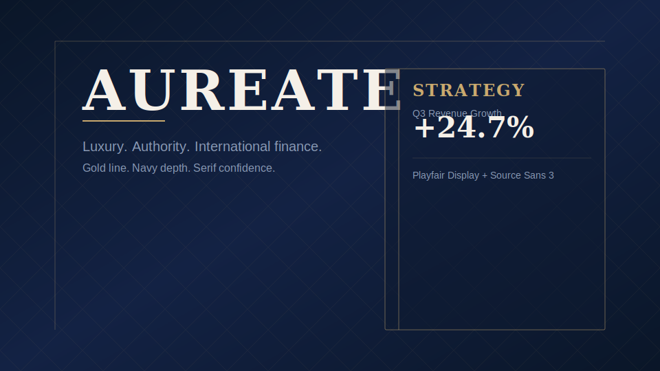

奢华、权威、金融。深蓝+金线，衬线标题，投行路演视觉。

</td>
</tr>
<tr>
<td width="50%">

### 5. 雾林 Mist Grove
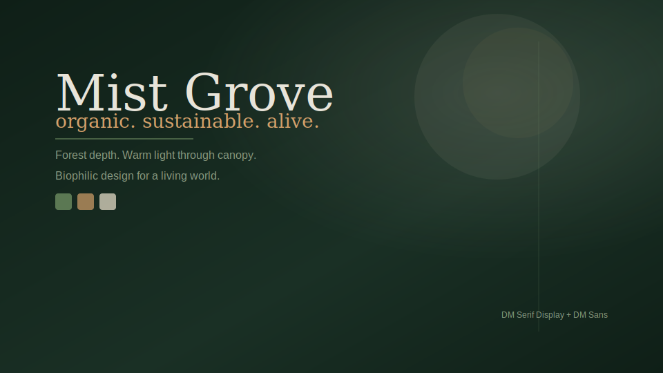

自然、可持续。深林底板+暖光斑，Biophilic 设计语言。

</td>
<td width="50%">

### 6. 冰川 Glacier
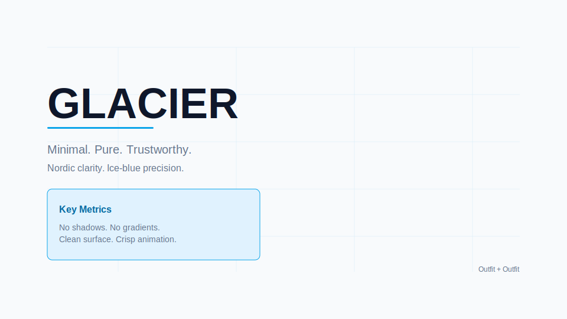

极简、纯净、可信。冰蓝细线，Nordic 极简，无阴影无渐变。

</td>
</tr>
<tr>
<td width="50%">

### 7. 混凝土 Concrete
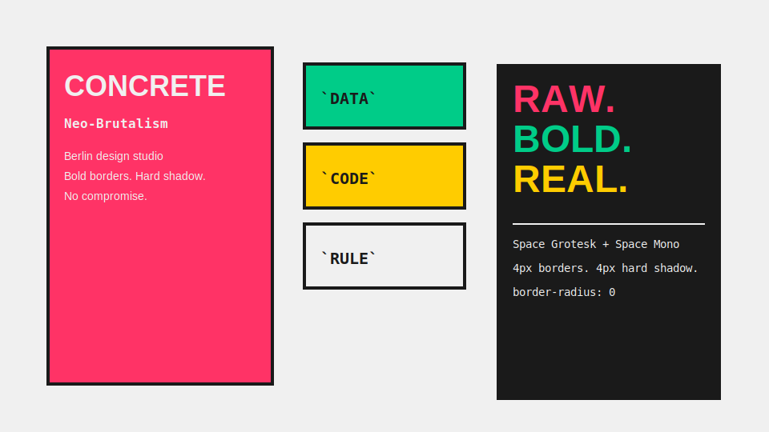

粗犷、Neo-Brutalism。4px 粗边框+硬阴影，饱和色块拼接。

</td>
<td width="50%">

### 8. 纸墨 Ink Paper
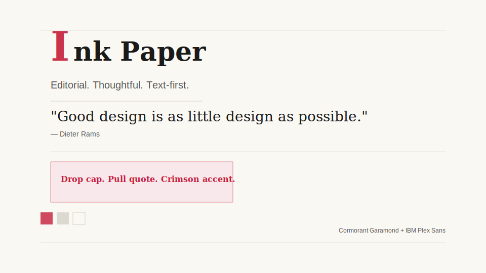

编辑感、沉思。暖米底板+墨红标注+drop cap，文字至上。

</td>
</tr>
<tr>
<td width="50%">

### 9. 电光 Volt
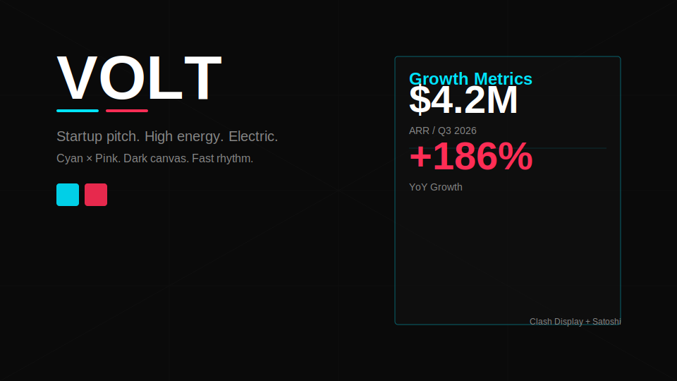

快节奏、创业路演。电光青+热粉红双强调，高对比高能量。

</td>
<td width="50%">

### 10. 砂岩 Sandstone
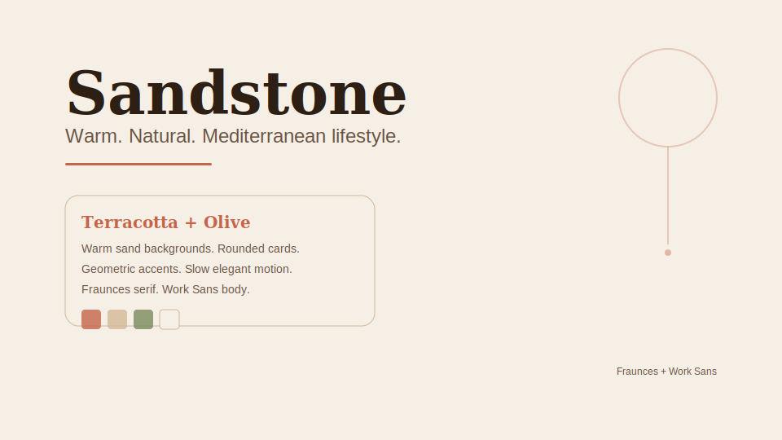

温暖、生活方式。赤陶+橄榄，圆角卡片，地中海阳光叙事。

</td>
</tr>
<tr>
<td width="50%">

### 11. 芭乐 Guava
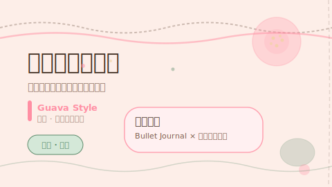

温暖、手绘、亲切。芭乐粉+皮绿，手绘波浪线，圆润字体，私人笔记本美学。

</td>
<td width="50%">

### 12. 玄金 Obsidian
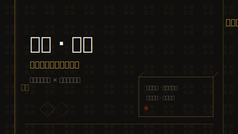

冷静沉着、中国漆器。碳黑+金漆描金，回纹暗纹，竖排签名，毛笔行楷装饰，千年对话。

</td>
</tr>
</table>

## 技术约束

- 幻灯片画布：固定 1920×1080，通过 JS transform 缩放
- 可见性控制：`.active`/`.visible` 类（绝不使用 `display: none/block`）
- CSS 函数取负：`calc(-1 * clamp(...))`（不可直接写 `-clamp()`）
- 字体：仅使用 Google Fonts 或 Fontshare（不使用系统字体）
- 必须支持 `prefers-reduced-motion`
- 幻灯片内部不允许滚动、溢出或面板重叠

## 工作流程

1. **阶段 0** — 模式检测（新建 / PPT 转换 / 增强）
2. **阶段 1** — 内容发现（用途、篇幅、密度、素材）
3. **阶段 2** — 样式发现（3 个视觉预览，选择其一）
4. **阶段 3** — 生成演示文稿（单一 HTML 文件）
5. **阶段 4** — PPT 转换（可选）
6. **阶段 5** — 交付与预览
7. **阶段 6** — 分享与导出（CloudStudio 部署 / PDF 导出）

## 当前状态

**框架已建立，12 套当代国际化风格预设已定义。** 设计细节可按需求进一步调整。

## 许可证

MIT
